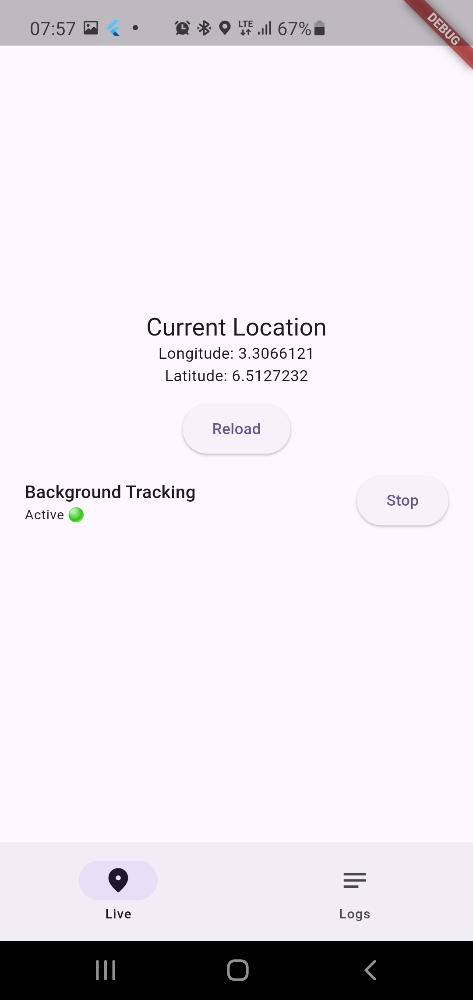
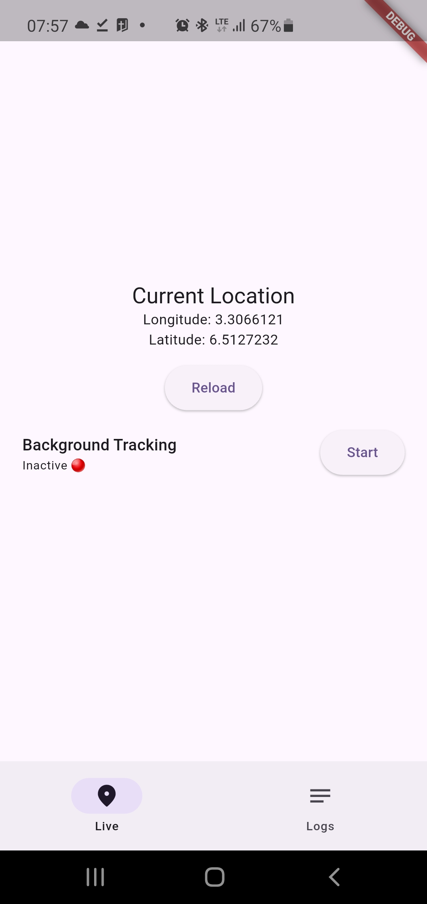
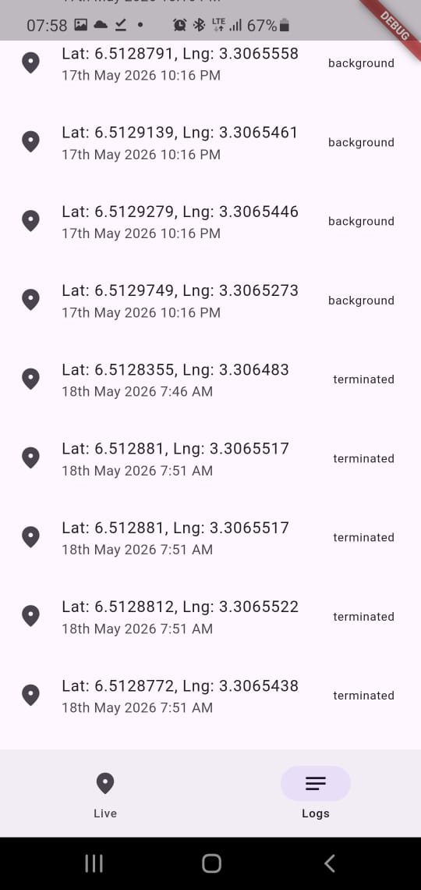

# Adora — Location Tracking Assessment

A Flutter application built as a hiring assessment. The app demonstrates foreground, background, and terminated-state location tracking on both Android and iOS, with a clean UI, persistent local logging, and a toggle to enable or disable background tracking.

---

## Screenshots

| Live Screen (Tracking Active) | Live Screen (Tracking Inactive) | Logs Screen |
|---|---|---|
|  |  |  |
 
---

## Download

> **Debug APK (Android)**
> [Download from Google Drive](https://drive.google.com/file/d/1RqSiEoCjZ8FM8P9HXdrELVHTOcKflQ2c/view?usp=drive_link)

Install steps:
1. Download the APK from the link above
2. On your Android device, enable **Install from unknown sources** in Settings
3. Open the downloaded APK and install

---

## Features

- **Foreground location** — fetches and displays the current device location with accurate GPS coordinates
- **Background location tracking** — continues tracking when the app is minimised or the screen is off
- **Terminated state tracking** — persists location updates via a headless Dart task even after the app is fully killed and removed from recents
- **Persistent notification** — displays a foreground service notification on Android showing that tracking is active
- **Location history log** — records every location update (latitude, longitude, timestamp, and source) to local storage
- **Background tracking toggle** — enables and disables background tracking from the UI with state persisted across app restarts
- **Permission handling** — gracefully handles all permission states including denied, permanently denied, and location services disabled, with contextual retry actions

---

## Tech Stack

| Layer | Choice |
|---|---|
| Framework | Flutter 3.32.8 |
| Language | Dart |
| State Management | Riverpod |
| Foreground Location | geolocator |
| Background & Terminated Location | flutter_background_geolocation (v5) |
| Local Storage | shared_preferences |

---

## Project Structure

```
lib/
├── main.dart                             # App entry point, headless task registration
├── background_task.dart                  # Headless callback for terminated-state tracking
│
├── enums/
│   ├── location_error.dart               # Error states for location permission handling
│   └── location_source.dart             # Foreground / background / terminated source tags
│
├── models/
│   └── location_record.dart             # Location entry data model with serialization
│
├── services/
│   ├── location_service.dart             # Foreground location & permission handling (geolocator)
│   ├── background_location_service.dart  # Background & terminated tracking (flutter_background_geolocation)
│   └── database_service.dart            # Local persistence via shared_preferences
│
└── ui/
    └── views/
        ├── live/
        │   ├── live_view.dart            # Home screen — current location + tracking toggle
        │   ├── live_provider.dart        # LiveNotifier — foreground location & toggle logic
        │   └── live_state.dart           # Immutable state for the live screen
        │
        ├── logs/
        │   ├── logs_view.dart            # History screen — scrollable list of location entries
        │   ├── logs_provider.dart        # LogsNotifier — fetches records from local storage
        │   └── logs_state.dart           # Immutable state for the logs screen
        │
        └── wrapper/
            ├── wrapper_view.dart         # Root view — bottom nav bar + PageView
            ├── wrapper_provider.dart     # WrapperNotifier — navigation and page control
            └── wrapper_state.dart        # Immutable state for the wrapper
```

---

## Architecture

The app follows a **feature-first architecture** with a clear separation between UI, state, and services.

- **LocationService** — wraps `geolocator` to handle permission requests and foreground location fetching
- **BackgroundLocationService** — wraps `flutter_background_geolocation` to configure, start, and stop background tracking. Initialised once at app startup in `WrapperView`
- **DatabaseService** — reads and writes location entries to `shared_preferences` as a JSON-encoded list
- **Riverpod Notifiers** — `LiveNotifier` manages foreground location state and the background tracking toggle; `LogsNotifier` manages the history list

### How terminated-state tracking works

When the app is fully killed, the Dart VM is dead — Flutter cannot run. `flutter_background_geolocation` works around this by registering a **headless Dart task** at the OS level via Android's `JobScheduler`. When a new location is available, the OS wakes a minimal Dart isolate to execute the headless callback, which writes the entry directly to `shared_preferences`. When the user reopens the app, the logs screen reads all persisted entries from storage.

---

## Getting Started

### Prerequisites

- Flutter `3.32.8`
- Dart SDK (bundled with Flutter)
- Android Studio or Xcode (for running on device/emulator)
- A **physical device** is strongly recommended for background and terminated state testing — emulators do not reliably simulate background location behaviour

### Installation

1. **Clone the repository**

```bash
git clone https://github.com/your-username/adora.git
cd adora
```

2. **Install dependencies**

```bash
flutter pub get
```

3. **Run the app**

```bash
flutter run
```

> No API keys or environment variables are required. `flutter_background_geolocation` is fully functional in debug builds without a license key.

---

## Known Limitations

- `flutter_background_geolocation` requires a paid license for **release builds** on Android. Debug builds work without one. See [transistorsoft.com](https://transistorsoft.com) for licensing.
- Location history is stored in `shared_preferences` and is not designed for indefinite accumulation. The list is capped at 100 entries.
- Terminated state tracking on iOS relies on significant location change monitoring, which may have longer intervals between updates than Android depending on device conditions.

---

## License

This project was built as a technical assessment and is not licensed for production use.